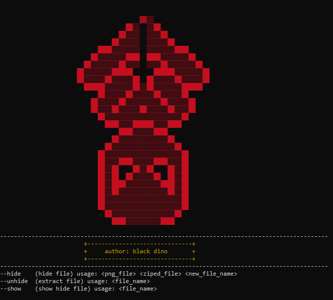

# Spidera


tools for hiding file into image or any files

## Installation

clone git repo

```bash
git clone https://github.com/Black-Dino/spidera.git
```

install dependencies
```bash
pip install -r requirements.txt
```

run python file
```bash
python main.py
```

## Documentation

### Hide File

using:
```py
python main.py --hide <filename> <ziped file> <new file name>
```

### Show hidden file
using:

```py
python main.py --show <file name>
```

### Extract File

using:
```py
python main.py --extract <filename> 
```

